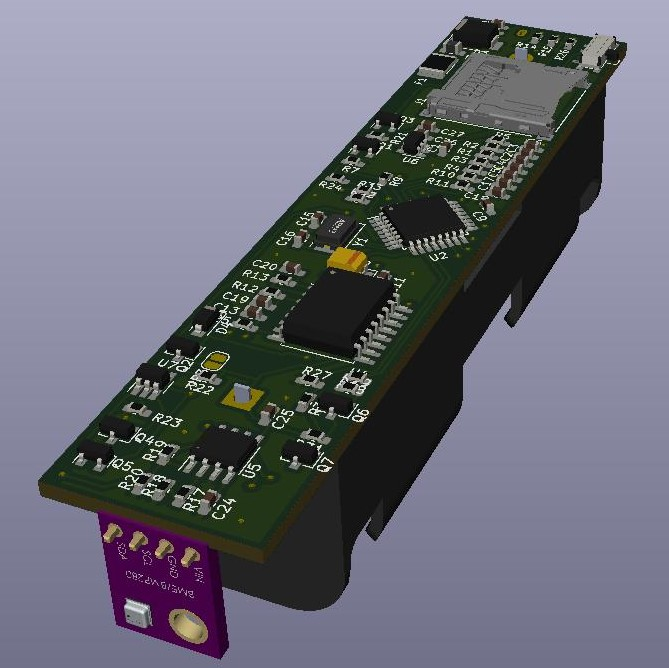

# OpenLogger

<!--

"Halley's method"
=640x640
{width=320 height=240}
-->
<!-- <figure>

<figcaption>Halley's method</figcaption>
</figure> -->
<!--  -->
<!--  -->
<!--  -->
<!--  -->
<!--  -->
<!--  -->
<!-- {width=50 height=50} -->
<!-- {width=500px}
{width=50} -->
<!-- {width=50%} -->

## Introduction

&nbsp;&nbsp;&nbsp;&nbsp;This project is and Open-source portable datalogger based on the ATmega328p microcontroller.

&nbsp;&nbsp;&nbsp;&nbsp; The intent for this project is to provide an cost-friendly solution to support micro and small companies as well as the generall public. The project consists in an semi-modular data acquisition device capable of comunication with probes compatible with digital comunication, like I2C, SPI, serial and PWM.
Open-source portable datalogger project based on the ATmega328p microcontroller.
